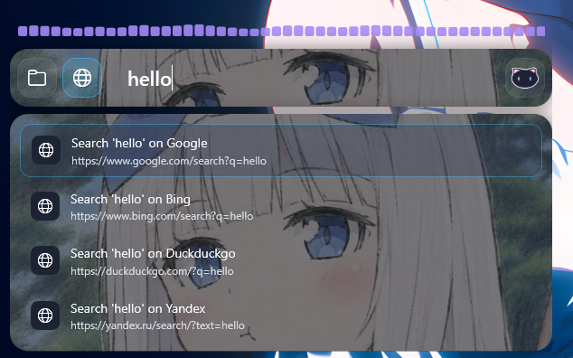
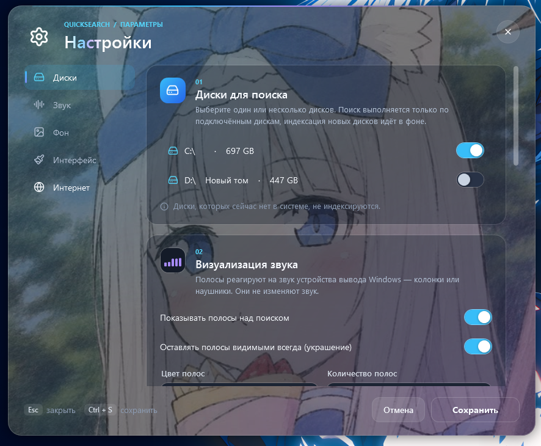
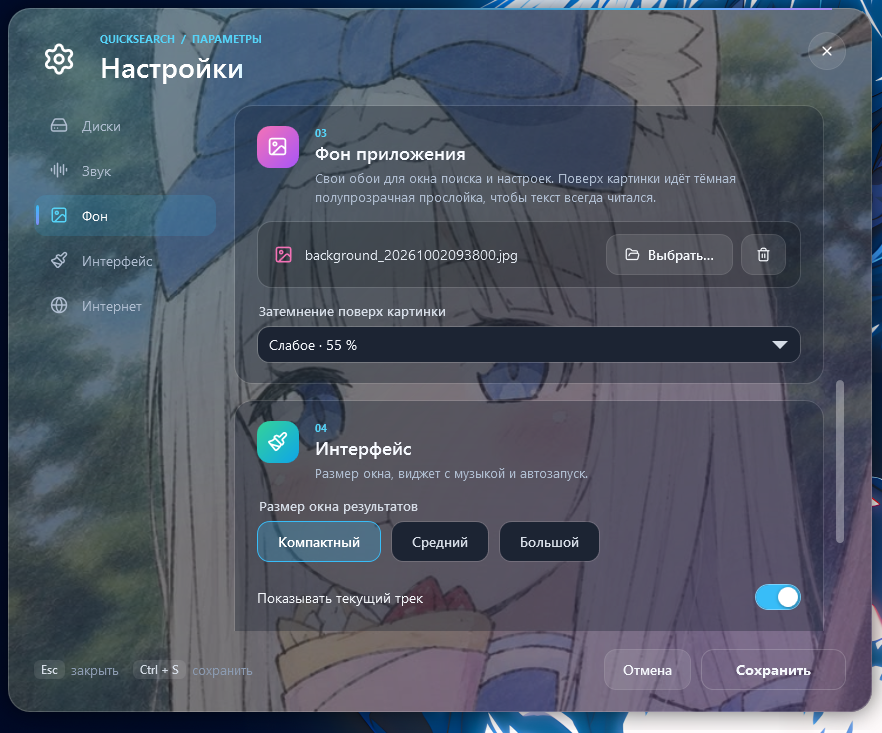
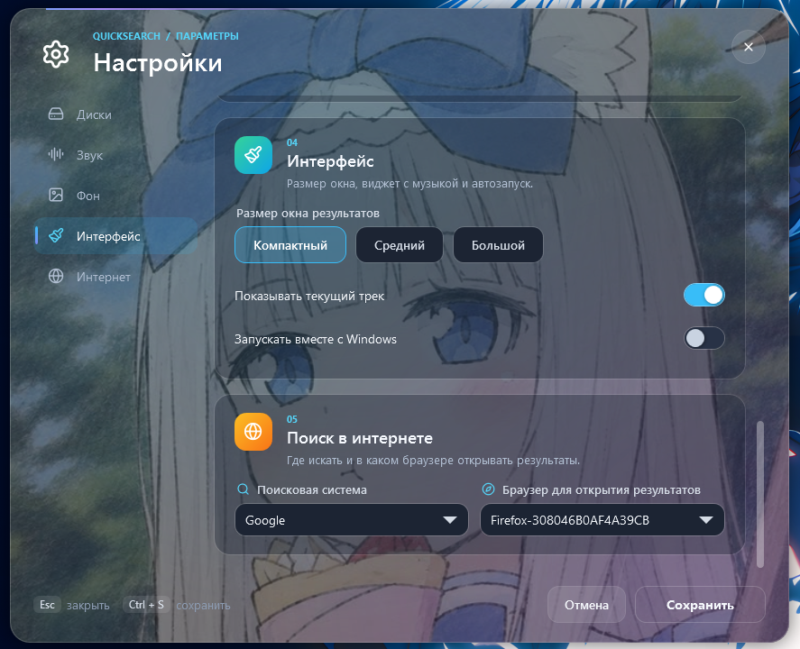

<div align="center">


<br>

# 🐾 QuickSearch

**Лёгкий лаунчер для Windows: нажми `Alt` + `Space` — и найди любой файл, папку или страницу в интернете за секунду.**

<br>


[](https://alalal68-wq.github.io/)
[](https://discord.com/invite/R4hcEfsFQq)
[](https://www.youtube.com/@python-v7)
[](https://www.donationalerts.com/r/bugcrack1)

</div>

---
[](https://github.com/alalal68-wq/QuickSearch/releases/download/v1.0.0/QuickSearch-v1.0.0.zip)
## 📑 Содержание

- [Скриншоты и демо](#-скриншоты)
- [О проекте](#-о-проекте)
- [Возможности](#-возможности)
- [Горячие клавиши](#-горячие-клавиши)
- [Настройки](#-настройки)
- [Установка и сборка](#-установка-и-сборка)
- [Как это устроено](#-как-это-устроено)
- [Структура репозитория](#-структура-репозитория)
- [Где хранятся данные](#-где-хранятся-данные)
- [Частые вопросы](#-частые-вопросы)
- [Благодарности и лицензии](#-благодарности-и-лицензии)
- [Автор и ссылки](#-автор-и-ссылки)
- [English summary](#-english-summary)

---

## 🐱 О проекте

**QuickSearch** — небольшая программа, которая живёт в трее и открывается по одному сочетанию клавиш. Строка поиска появляется поверх любого окна, ты вводишь запрос и сразу получаешь:

- **файлы и папки** с выбранных дисков — мгновенно, из собственного индекса;
- **поиск в интернете** — в Google, Bing, DuckDuckGo или Яндексе, в том браузере, который ты выбрал.

Никаких облаков и аккаунтов: индекс лежит на твоём компьютере, программа ничего никуда не отправляет. Интерфейс можно оформить под себя: свои обои, размер окна, виджет с текущим треком и анимированные звуковые полосы, которые реагируют на музыку.

Маскот проекта — чёрный котик 🐈‍⬛, он же иконка приложения.

## 🖼 Скриншоты

| Окно поиска | Настройки: диски |
|---|---|
|  |  |

| Настройки: звук | Настройки: фон |
|---|---|
|  |  |

| Настройки: интерфейс | Настройки: интернет |
|---|---|
|  |  |

### 🎬 Демо


---

## ✨ Возможности

### 🔍 Поиск файлов и папок

- **Глобальное сочетание `Alt` + `Space`** открывает и закрывает окно поиска из любой программы.
- **Собственный индекс.** Выбранные диски сканируются в фоне, результаты ищутся по индексу в памяти, поэтому ответ появляется сразу, пока ты печатаешь.
- **Умная сортировка:** точное совпадение имени → имя начинается с запроса → запрос внутри имени → запрос внутри пути. Внутри группы выше те файлы, что изменялись недавно.
- **Пустая строка — недавние файлы.** Пока ты ничего не ввёл, показываются последние изменённые файлы с подключённых дисков.
- **Вставка пути.** Можно вставить готовый путь (даже в кавычках, как его копирует Проводник) — он сразу окажется первым в списке, даже если индексатор ещё не дошёл до этой папки.
- **Всегда актуально.** Наблюдатель за файловой системой подхватывает создание, переименование и удаление файлов, изменения применяются пакетами раз в полсекунды и не нагружают систему.
- **Исключения.** По умолчанию не индексируются `Windows`, `Program Files`, `Program Files (x86)`, `$Recycle.Bin`, `node_modules`, `.git` и временные файлы. Ссылки и точки повторной обработки (symlink/junction) пропускаются, чтобы не зациклиться.
- **Несколько дисков.** Подключай любые диски; отключённые диски не индексируются, а их старые результаты пропадают из выдачи.

### 🌐 Поиск в интернете

- Переключение между режимами **«Файлы» и «Интернет»** клавишей `Tab`.
- Поисковые системы: **Google, Bing, DuckDuckGo, Яндекс** — выбранная показывается первой.
- **Свой браузер.** Программа находит установленные браузеры и открывает результаты в том, который ты выбрал (или в браузере по умолчанию).

### 🎵 Виджет с музыкой

- Показывает **текущий трек** из системных медиа-элементов управления Windows — работает с любым плеером или сайтом, который сообщает Windows, что играет (Spotify, браузеры, локальные плееры и т. д.).
- Включается и выключается одной галочкой в настройках.

### 🎚 Визуализация звука

- **Звуковые полосы над строкой поиска** реагируют на звук, который выводится на колонки или наушники (перехват WASAPI loopback). Программа только слушает уровень сигнала и **ничего не меняет в звуке**.
- Настраиваются **цвет**, **количество** (12–64, по умолчанию 48) и **ширина** полос.
- **Отдельный эквалайзер-оверлей** — декоративная полоса на экране без окна поиска. Два режима:
  - **Рабочий стол** — полосы «приклеены» к уровню обоев, за иконками рабочего стола (как скины Rainmeter) и видны, когда окна свёрнуты;
  - **Поверх окон** — полосы всегда на виду, не перехватывают клики и не забирают фокус.
- Ширина оверлея задаётся в процентах от ширины экрана.

### 🎨 Оформление

- **Свои обои** для окна поиска и настроек. Поверх картинки идёт тёмный полупрозрачный слой, регулируемый в настройках, чтобы текст всегда читался. Большие картинки автоматически уменьшаются при загрузке, чтобы не тормозить запуск.
- **Три размера окна:** компактный, средний, большой.
- Тёмная стеклянная тема, плавные анимации, векторные иконки ([Lucide](https://lucide.dev)) — чёткие на любом масштабе экрана.

### ⚙ Система

- **Иконка в трее:** клик — показать/скрыть окно; меню — «Open Search», «Settings», «Exit».
- **Автозапуск с Windows** (запускается свёрнутым в трей).
- **Один экземпляр:** повторный запуск не создаёт второй процесс.
- **Быстрый старт:** окно открывается сразу, а сохранённый индекс догружается в фоне.
- **Защита от вылетов:** необработанные ошибки пишутся в журнал, а не закрывают программу молча.

---

## ⌨ Горячие клавиши

| Где | Клавиша | Действие |
|---|---|---|
| Везде | `Alt` + `Space` | Показать / скрыть окно поиска |
| Окно поиска | `Enter` | Открыть выбранный результат |
| Окно поиска | `↑` / `↓` | Перемещение по результатам |
| Окно поиска | `Tab` | Переключить режим «Файлы» ⇄ «Интернет» |
| Окно поиска | `Esc` | Скрыть окно |
| Настройки | `Ctrl` + `S` | Сохранить |
| Настройки | `Esc` | Закрыть |
| Трей | Левый клик | Показать / скрыть окно |

Окно поиска само скрывается, когда ты переключаешься на другое приложение.

---

## ⚙ Настройки

Настройки открываются кнопкой с котиком в строке поиска или через меню в трее. Окно разделено на пять разделов:

| Раздел | Что настраивается |
|---|---|
| 💽 **Диски** | Какие диски индексировать. Новые диски индексируются в фоне, отсутствующие в системе — пропускаются. |
| 🎵 **Звук** | Звуковые полосы: включение, цвет, количество, ширина; режим и ширина эквалайзера-оверлея; «всегда на виду». |
| 🖼 **Фон** | Своя картинка-обои и степень затемнения поверх неё. |
| 🖌 **Интерфейс** | Размер окна результатов (компактный / средний / большой), показ текущего трека, запуск вместе с Windows. |
| 🌐 **Интернет** | Поисковая система и браузер для открытия результатов. |

Изменения применяются после нажатия **«Сохранить»** (`Ctrl` + `S`).

---

## 🚀 Установка и сборка

### Требования

| | Для запуска | Для сборки |
|---|---|---|
| ОС | Windows 10 / 11, 64-bit | Windows 10 / 11, 64-bit |
| .NET | [.NET 8 Desktop Runtime](https://dotnet.microsoft.com/download/dotnet/8.0) | [.NET 8 SDK](https://dotnet.microsoft.com/download/dotnet/8.0) |

Права администратора **не нужны**. Папки, к которым у программы нет доступа, просто пропускаются.

### Быстрая сборка одним файлом

В корне репозитория лежит `run.bat`:

```bat
run.bat          :: собрать exe и сразу запустить
run.bat norun    :: только собрать
```

Скрипт закрывает запущенный QuickSearch, собирает проект в режиме Release (с ускорением запуска ReadyToRun), встраивает иконку-котика в `.exe` и кладёт результат сюда:

```
dist\QuickSearch\QuickSearch.App.exe
```

### То же вручную (PowerShell)

```powershell
git clone https://github.com/alalal68-wq/QuickSearch.git
cd QuickSearch

# собрать exe в папку dist\QuickSearch
dotnet publish code\QuickSearch.App\QuickSearch.App.csproj -c Release -r win-x64 --self-contained false -o dist\QuickSearch

# или просто запустить из исходников
dotnet run --project code\QuickSearch.App -c Release
```

> Если сборка с `-p:PublishReadyToRun=true` ругается (например, нет интернета для скачивания пакета), просто уберите этот параметр — приложение соберётся и без него, только стартует чуть медленнее.

Чтобы поделиться программой, заархивируйте папку `dist\QuickSearch` — для запуска у получателя должен быть установлен .NET 8 Desktop Runtime.

---

## 🧩 Как это устроено

Решение состоит из двух проектов:

```
QuickSearch.Core   — логика без интерфейса: индекс, поиск, браузеры, медиа, настройки
QuickSearch.App    — WPF-приложение: окна, тема, горячая клавиша, трей, звуковые полосы
```

**Индекс.** При запуске открывается база [LiteDB](https://www.litedb.org/) с сохранённым индексом, а сам индекс догружается в оперативную память в фоне. Весь поиск идёт по памяти и не обращается к диску; запись в базу выполняет отдельный фоновый поток пакетами. Поэтому поиск быстрый, а запуск не ждёт, пока прочитаются сотни тысяч записей.

**Сканирование.** Выбранные диски обходятся в фоне по папкам (с исключениями), а `FileSystemWatcher` следит за изменениями. Классы `MftReader` и `UsnJournalWatcher` названы исторически: они не читают MFT и журнал USN напрямую, а используют обычные средства .NET, поэтому права администратора не требуются.

**Поиск.** Источники результатов реализуют общий интерфейс `ISearchProvider`: `FileSearchProvider` ищет по индексу, `WebSearchProvider` собирает ссылки для поисковых систем.

**Музыка и звук.** Текущий трек берётся из `GlobalSystemMediaTransportControls` (WinRT), уровень звука — из WASAPI loopback стандартного устройства вывода.

**Стек:** C# · .NET 8 · WPF · Windows Forms (иконка в трее) · LiteDB 5 · Microsoft.Xaml.Behaviors.Wpf.

---

## 📁 Структура репозитория

```
QuickSearch/
├── README.md
├── LICENSE
├── run.bat                      сборка exe с иконкой + запуск
├── assets/                      логотип, баннер и картинки для GitHub
│   ├── logo.png
│   ├── banner.png
│   ├── social-preview.png       картинка для предпросмотра ссылки (1280×640)
│   ├── icon.ico
│   └── cat_source.png           исходный рисунок котика
└── code/                        весь код проекта
    ├── QuickSearch.sln
    ├── QuickSearch.Core/
    │   ├── Autostart/           автозапуск с Windows
    │   ├── Browser/             поиск установленных браузеров
    │   ├── FileIndex/           индекс, сканер дисков, наблюдатель за файлами
    │   ├── Media/               текущий трек
    │   ├── Search/              файловый и интернет-поиск
    │   └── Settings/            модель и сохранение настроек
    └── QuickSearch.App/
        ├── Assets/              иконки интерфейса (Lucide) и котик
        ├── Converters/          конвертеры значений для XAML
        ├── Services/            горячая клавиша, звук, фон
        ├── Themes/              тёмная тема
        ├── ViewModels/          логика окна поиска
        ├── Views/               окна: поиск, настройки, эквалайзер-оверлей
        └── icon.ico             иконка приложения (16–256 px)
```

---

## 💾 Где хранятся данные

Всё лежит в `%AppData%\QuickSearch` (обычно `C:\Users\<имя>\AppData\Roaming\QuickSearch`):

| Файл | Что это |
|---|---|
| `settings.json` | Твои настройки |
| `fileindex.db` | Сохранённый индекс файлов (можно удалить — он пересоздастся) |
| `startup.log` | Время каждого этапа запуска — полезно, если программа стартует медленно |
| `crash.log` | Журнал ошибок |

Выбранная картинка-фон тоже копируется в эту папку. Чтобы «сбросить» программу, закрой её и удали папку.

---

## ❓ Частые вопросы

<details>
<summary><b>Alt + Space ничего не делает</b></summary>

Это сочетание могла занять другая программа (например, PowerToys Run или похожие лаунчеры) — закрой её. Убедись также, что QuickSearch запущен: его иконка должна быть в трее.
</details>

<details>
<summary><b>После запуска результатов поиска меньше, чем должно быть</b></summary>

В первые секунды сохранённый индекс ещё догружается в фоне, а новые диски индексируются в фоне. Подожди немного и повтори запрос. Проверь также, что нужный диск отмечен в настройках → «Диски» и папка не входит в исключения.
</details>

<details>
<summary><b>Программа долго запускается</b></summary>

Открой `%AppData%\QuickSearch\startup.log` — там по шагам видно, на что уходит время. Также собирай через `run.bat`: он включает ReadyToRun, и запуск становится быстрее.
</details>

<details>
<summary><b>Проводник показывает старую иконку</b></summary>

Windows кэширует иконки. `run.bat` обновляет кэш сам; если не помогло — перезапусти Проводник или переименуй `.exe`.
</details>

<details>
<summary><b>SmartScreen предупреждает при первом запуске</b></summary>

Самостоятельно собранный `.exe` не подписан сертификатом, поэтому Windows может показать предупреждение. Нажми «Подробнее» → «Выполнить в любом случае». Код полностью открыт, можно собрать программу самому.
</details>

<details>
<summary><b>Программа закрылась с ошибкой</b></summary>

Загляни в `%AppData%\QuickSearch\crash.log` и пришли его содержимое в [Discord](https://discord.com/invite/R4hcEfsFQq) — разберёмся.
</details>

---

## 🙏 Благодарности и лицензии

Код проекта распространяется по лицензии **MIT** (см. [`LICENSE`](LICENSE)).

Использованные сторонние материалы:

| Что | Лицензия |
|---|---|
| [Lucide](https://lucide.dev) — иконки интерфейса (`code/QuickSearch.App/Assets/Icons`) | ISC |
| [LiteDB](https://www.litedb.org/) — локальная база индекса | MIT |
| [Microsoft.Xaml.Behaviors.Wpf](https://github.com/microsoft/XamlBehaviorsWpf) | MIT |

Котик-маскот нарисован автором проекта.

---

## 💬 Автор и ссылки

Если проект пригодился — зайди в гости, расскажи друзьям или поддержи автора, это очень мотивирует делать новые версии 💙

| | |
|---|---|
| 🌐 **Мой сайт** | [alalal68-wq.github.io](https://alalal68-wq.github.io/) |
| 💬 **Discord** | [discord.com/invite/R4hcEfsFQq](https://discord.com/invite/R4hcEfsFQq) |
| ▶ **YouTube** | [youtube.com/@python-v7](https://www.youtube.com/@python-v7) |
| ❤ **Донаты** | [donationalerts.com/r/bugcrack1](https://www.donationalerts.com/r/bugcrack1) |

Нашёл ошибку или есть идея? Открой **Issue** в этом репозитории или напиши в Discord. Pull request'ы тоже приветствуются.

---

## 🌍 English summary

<details>
<summary><b>Click to expand</b></summary>

**QuickSearch** is a lightweight Windows launcher (WPF, .NET 8). Press `Alt` + `Space` anywhere to search your files and folders from an in-memory index, or switch with `Tab` to a web search in Google, Bing, DuckDuckGo or Yandex, opened in the browser of your choice.

**Features:** multi-drive background indexing with live file-system updates · smart ranking and recent files on an empty query · pasted paths resolve instantly · now-playing widget (Windows media controls) · audio-reactive bars and a desktop equalizer overlay (WASAPI loopback, read-only) · custom wallpaper with adjustable dimming · three window sizes · tray icon, autostart, single instance.

**Build:** install the [.NET 8 SDK](https://dotnet.microsoft.com/download/dotnet/8.0), then run `run.bat` in the repository root. The result is `dist\QuickSearch\QuickSearch.App.exe` with the cat icon embedded. No administrator rights are required.

**Data** is stored in `%AppData%\QuickSearch` (settings, index, logs). Licensed under MIT; icons by [Lucide](https://lucide.dev) (ISC).

**Links:** [website](https://alalal68-wq.github.io/) · [Discord](https://discord.com/invite/R4hcEfsFQq) · [YouTube](https://www.youtube.com/@python-v7) · [donate](https://www.donationalerts.com/r/bugcrack1)

</details>
